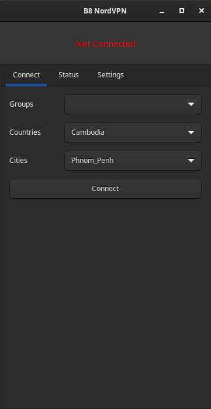
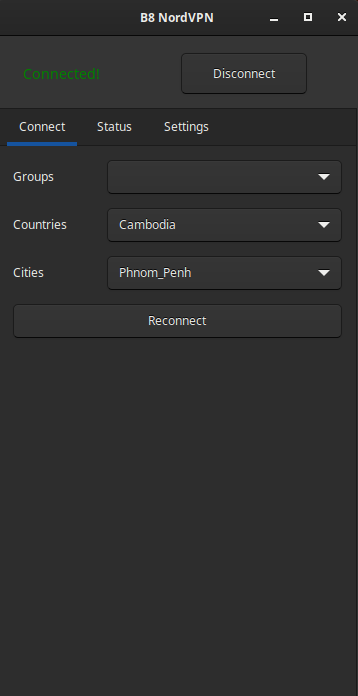
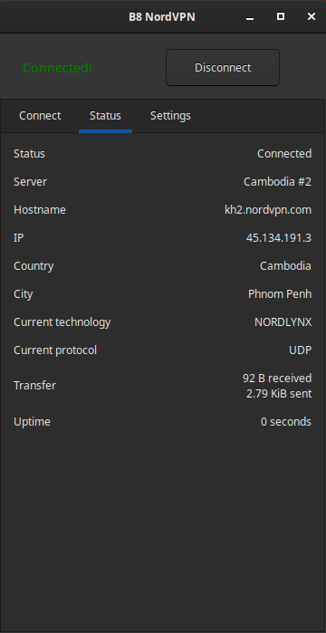
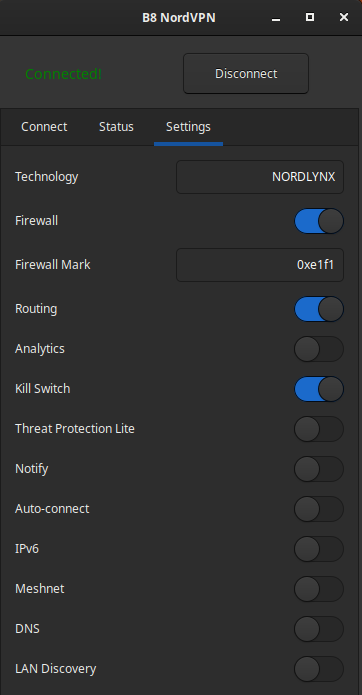

# Visual NordVPN
## About
Just a tool to make my life easier. Got tired of typing the `nordvpn` command 10 times per day.

App covers most of the basic functionalities and configurations you probably need:
- Lists the Groups, Countries and Cities and has an easy one-click button to connect, reconnect to new route, and disconnect.
- Simple on/off switch for most of the True/False configs, such as Kill Switch, Firewall, Auto connect, Routing, etc.
- Handy status tab to quickly check some info about your connection.
- All code based, no XML or Glade.
- Since it's only a single python file/class, you can quickly integrate it with your desktop widgets and plugins.
- Not the most beautiful app in the world, but it does make life easier.







## Requirements
- Obviously, NordVPN's Linux app (the one with the `nordvpn` command)
- Python 3
- PyCairo `python3-cairo` and PyGObject `python3-gi` (you probably already have it if you are a Gnome person - or any DE/WM based on GTK)
- If you are a KDE person, you need **GTK3**, so I'll just leave it up to you. I'm really not in the mood of going QT right now... but feel free to contribute!

## Installation:
### Global
To install for all users, as **root**:
```
chmod +x install
./install
```

Required **PATH** on environmental variables:  `/usr/local/bin/`
### Local
To install only on your home folder:
 ```
chmod +x install_local
./install_local
```

## Execute:
- Click on black NordVPN icon at the menu's Internet folder
- If you installed it globally, you also get a `easynordvpn` command

## Uninstall:
If globally installed, run as **root**.
```
chmod +x uninstall
./uninstall
```

Undones everything that the installation did, in reverse order

## Install Locations:
### Globally
- Files are copied to `/opt/easynordvpn`
- Main executable is linked to `/usr/local/bin`
- Icon is copied to `/usr/local/share/icons`
- Desktop file is copied to `/usr/local/share/applications`

### Local
- Files are copied to `~/.local/share/easynordvpn`
- Icon is copied to `~/.local/share/icons`
- Desktop file is copied to `~/.local/share/applications`

## Help me out:
### Venv
```
python -m venv venv
source venv/bin/activate
```

### Gtk3
```
pip install pycairo PyGObject
```
...or just
```
pip install -r requirements.txt
```

### Linting for Gtk3
```
pip install pygobject-stubs --no-cache-dir --config-settings=config=Gtk3,Gdk3,Soup2
```
If installed with **requirements.txt**, remove pygobject-stubs `pip uninstall pygobject-stubs` and reinstall using the params above

### VS Code
**.vscode** folder included with **launch.json**

You should be able to run directly through the green *Play* button on *Run and Debug*
